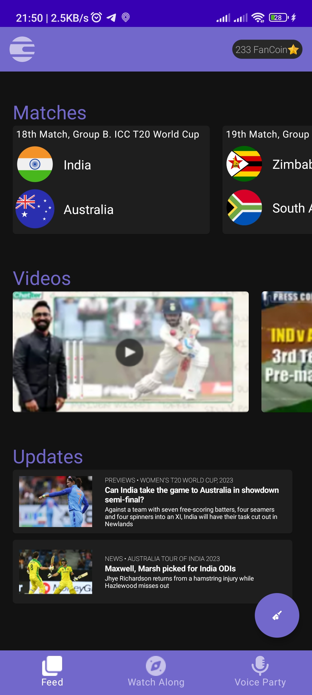
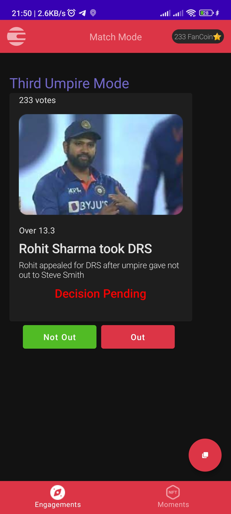
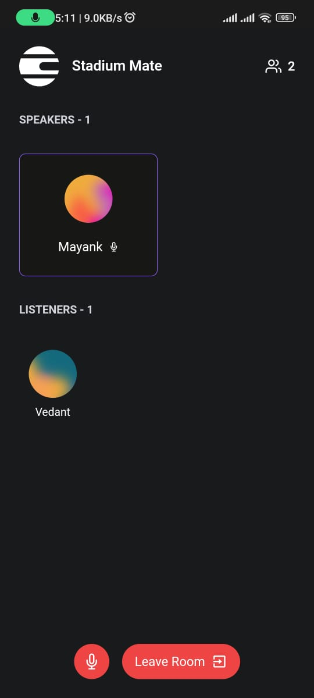

# Stadium Mate

**“A must-have app for cricket fans, whether you’re heading to the match or enjoying it from home.”**

Stadium Mate is a mobile app designed to elevate the experience for cricket enthusiasts. It caters to two distinct audiences: those attending the match in the stadium and those watching from the comfort of their homes.

- 🏟️ **At the Stadium:**
  - Answer trivia questions during extra innings.
  - Engage in Third Umpire Mode during DRS reviews.

- 🏠 **At Home:**
  - Host or join watch parties for a stadium-like experience.
  - Virtually connect with fellow cricket fans using the voice party feature.

All user activities accumulate loyalty points, redeemable for discounts on merchandise and future app purchases.

## Features 🔧

- Host and join watch parties
- Earn blockchain-based loyalty points
- Connect with cricket fans via voice party
- Match Mode for a simplified UI during matches
- Answer trivia questions and earn points
- Engage in Third Umpire Mode during DRS reviews
- Get the latest news and scores
- Cross-platform support (web and app)

## Screenshots 📷

- **Splash Screen**

  

- **Main Screen**

  

- **Match Mode**

  

- **Voice Party**

  

## Video 🎥

- **Demo**

  <video width="300" controls>
    <source src="Images-and-Videos/Demo-Video.mp4" type="video/mp4">
  </video>